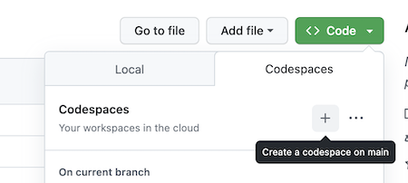

# Fundamentos de Programação – Estrutura de Dados

Este é o repositório do curso `Fundamentos de Programação – Estrutura de Dados`. Você pode acessar o conteúdo completo no [LinkedIn Learning][lil-course-url]. 

![Título completo do curso][lil-thumbnail-url] 

Este curso oferece uma introdução abrangente sobre estruturas de dados, explorando conceitos fundamentais e suas aplicações práticas. Os tópicos incluem: strings, dados numéricos, ponteiros e referências, vetores (unidimensionais, multidimensionais e mutáveis), busca e ordenação de vetores, notação Big O, listas encadeadas (simples e duplas), pilhas, filas, estruturas hash (dicionários e funções hash), árvores e heaps (conjuntos, árvores de busca binária e heaps). Com exemplos práticos, analogias explicativas e arquivos para acompanhamento, este curso tem como objetivo oferecer uma base para auxiliar na escolha da estrutura de dados mais adequada para as suas necessidades e situações.

## Instruções 

Este curso está integrado ao GitHub Codespaces, um ambiente desenvolvedor instantâneo na nuvem que oferece toda a funcionalidade do seu IDE favorito sem a necessidade de configurar o dispositivo local. Com o Codespaces, você pode praticar em qualquer dispositivo, a qualquer momento - tudo isso sem precisar instalar nenhuma outra ferramenta. 

Para acessar, clique no botão verde "Code", selecione a aba Codespace e inicie um novo. 

Todos os arquivos estarão lá organizados por capítulo e video.

Confira o vídeo deste curso "Como usar o GitHub Codespaces" para saber mais.

### Instrutor(a) 

**Lucas Longo** 

Confira meus outros cursos no [LinkedIn Learning](https://www.linkedin.com/learning/instructors/lucas-longo). 

[0]: # (Replace these placeholder URLs with actual course URLs) 
[lil-course-url]: https://www.linkedin.com/learning/fundamentos-de-programacao-estruturas-de-dados-22871998/conheca-as-estruturas-de-dados 
[lil-thumbnail-url]: https://media.licdn.com/dms/image/D560DAQETu_bkJBUkdA/learning-public-crop_675_1200/0/1696225230002?e=1697616000&v=beta&t=bFR48bUymck9mLZeBRfTXoHWFazYuIhJlnhK1reMCy0 
[Veja onde clicar]: https://github.com/LinkedInLearning/Fundamentos-Programacao-Estruturas-Dados-2600255/blob/main/CodespacesInstruction.png?raw=true

[1]: # (End of BP-Instruction ###############################################################################################) 
